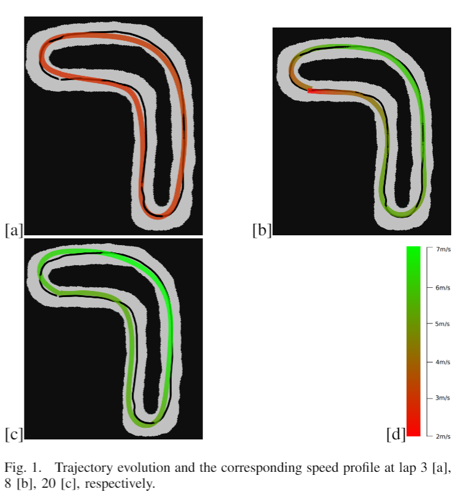
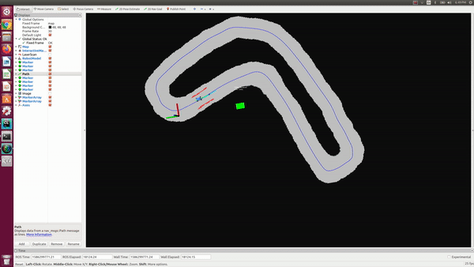
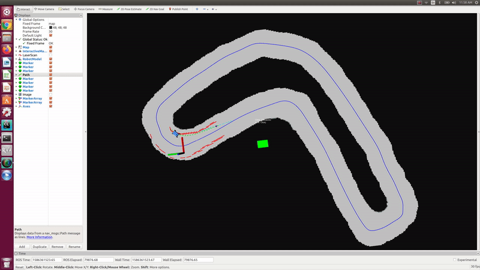
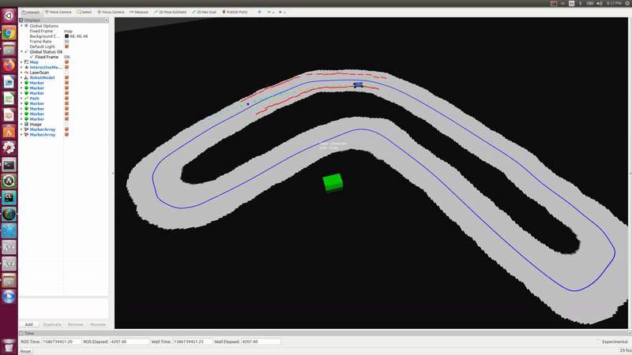
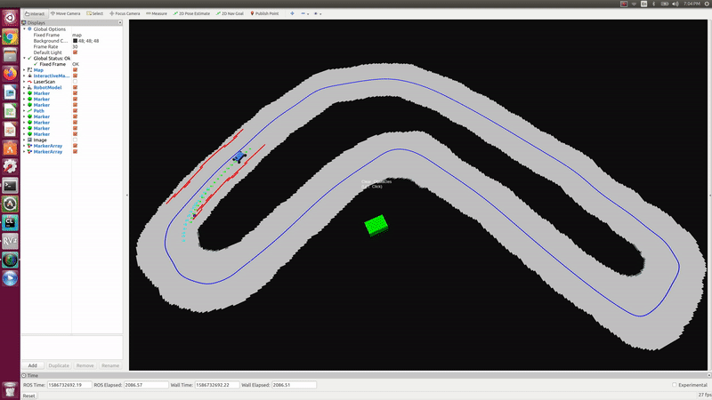
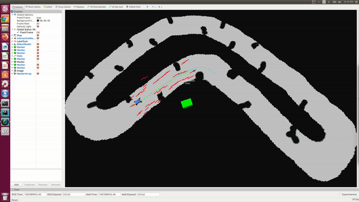
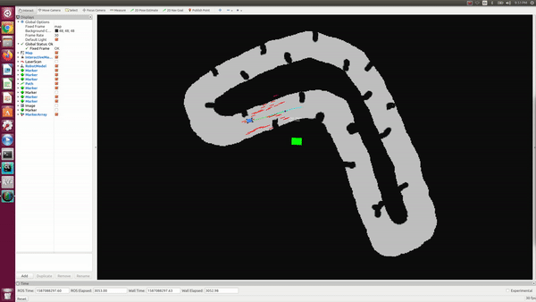
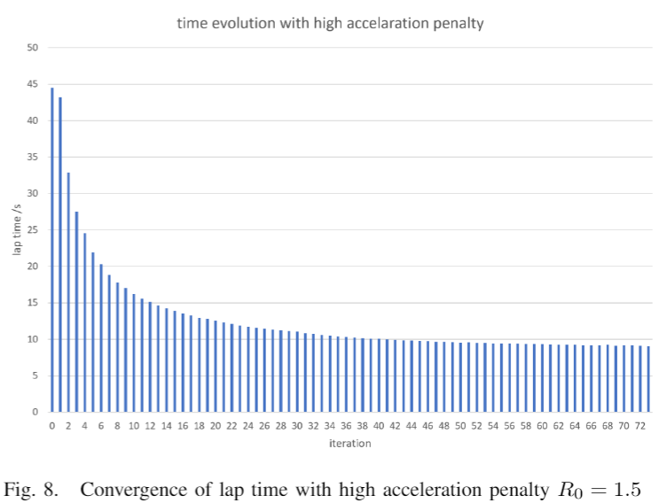
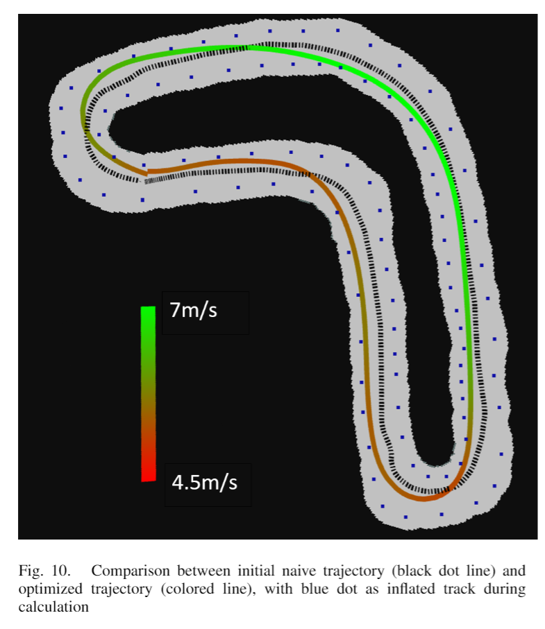

# LearningMPC
Learning based Model Prodictive Control for online iterative trajectory optimization for F1/10 autonomous racing.

The F1/10 hardware used for experiments:

  

The car is learning to improve its racing policy iteratively online as it completes more and more laps, until the policy converges to a minimum lap time. 

Initial Sample Safe Set is collected using a path following controller. Starting from Lap 3, control policies are generated by learning MPC. Every time a lap is completed, cost-to-go values are updated for all collected samples. Stability and recursive feasibility of MPC is gauranteed by enforcing the terminal state to land within a convex hull of a selected subset of collected samples from previous laps. The MPC manages to minimize the cost-to-go for the terminal state at each run, and is solved with OSQP solver at 20Hz. The sample safe set continues to grow as more and more data is being collected along the way.

The improvement of racing performance over laps is shown here below.

Lap 5 (Top speed 1.2 m/s)

Lap 25 (Top speed 3 m/s)

After Lap 60, it converges to an optimal policy (Top speed 6 m/s) with precisely controlled high speed drifting.

.

With low frictions, it converges to a policy with lower top speed but with more drifting.

.

Obstacle Avoidance 1:

.

Obstacle Avoidance 2 (low friction): 

.

Lap time vs number of iterations completed:

Converged optimal policy recorded:

Currently working on Gaussian Process and local linear regression for system identification to update the dynamic model online.

The project is inspired by "Learning How to Autonomously Race a Car: a Predictive Control Approach, Ugo Rosolia and Francesco Borrelli"

